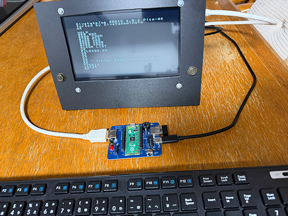
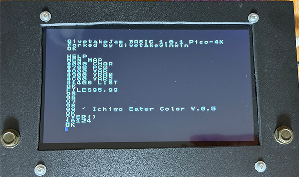
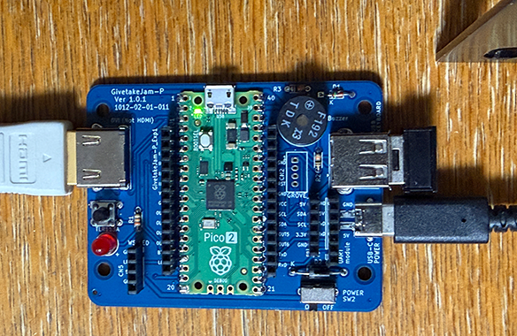
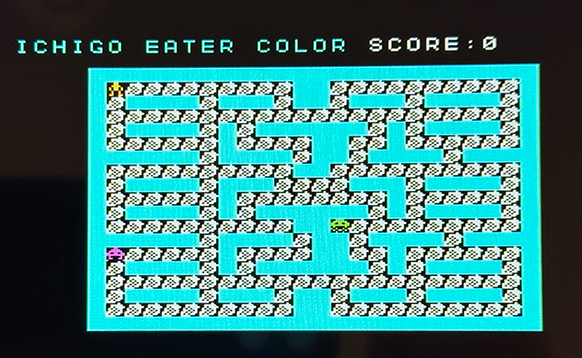
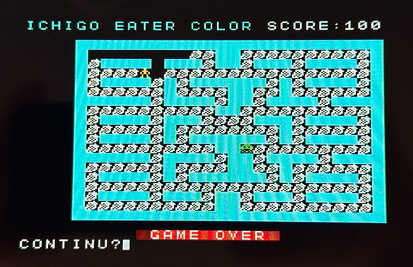

# GivetakeJam BASIC  
### Extended IchigoJam BASIC for Raspberry Pi Pico


-16126-brightgreen)


## Overview / 概要

**GivetakeJam BASIC** is an extended version of IchigoJam BASIC for Raspberry Pi Pico.

This firmware enhances program capacity, expands array variables, improves external EEPROM handling, and adds NEC infrared reception, environmental sensing, and color display / palette / attribute commands while maintaining compatibility with the original IchigoJam BASIC design.

**GivetakeJam BASIC** は Raspberry Pi Pico 向け IchigoJam BASIC の拡張版です。  
プログラム容量の拡張、配列変数の拡張、外部 EEPROM 対応の改善、NEC 赤外線受信コマンド、環境測定コマンド、カラー表示・パレット変更・色属性コマンドの追加を行い、従来の IchigoJam BASIC との互換性を維持しています。

## Version / バージョン

- `16100` : original base version
- `16112` : infrared receiver build
- `16114` : environmental measurement build
- `16115` : fixed `WS.LED` array access for extended arrays and added bounds checking.
- `16120` : RP2350 build supports HSTX DVI video output.
- `16121` : RP2350 build extended arrays to `[358]..[1125]`
- `16122` : RP2350 HSTX DVI dirty-row rendering, DRAW redraw fix, VIDEO resume redraw fix, and Japanese keyboard default when unset.
- `16123` : RP2350 build fixed `WS.LED` array access for extended arrays and added bounds checking.
- `16124` : RP2350 build added MSX-style `COLOR f[,b[,c]]` command for HSTX DVI text output.
- `16125` : Added `PAL`, `PAL RESET`, `PAL(n)`, `ATTR`, and `ATTR(x,y)` for HSTX DVI palette and text attribute control.
- `16126` : RP2350 build refreshes HSTX DVI display after `POKE` writes to VRAM and PCG.

## Highlights / 主な特徴

- 4096-byte program size
- Internal storage slots RP2040:`25`, RP2350:`100`
- Extended arrays RP2040:`[102]..[357]`, RP2350:`[102]..[1125]`
- `VAR2` area at `#C00`
- `LIST` area at RP2040:`#E00`, RP2350:`#1400`
- `IR.IN` NEC infrared receiver command
- `ENV.IN` AHT20 + BMP280 environment sensor command
- `COLOR` MSX-style text color command for RP2350 HSTX DVI output
- External EEPROM support (`24LC64` / `24LC256` / `24FC1025`)
- RP2350 build: default keyboard layout is Japanese when the keyboard setting flash area is unset.

## Memory Map / メモリーマップ

```text
#000 CHAR
#700 PCG
#800 VAR
#900 VRAM
#C00 VAR2
#E00 LIST (RP2040)
#1400 LIST (RP2350)
```

## Screenshots / スクリーンショット

### Runtime Environment


### Display Examples


### Compatible Board


### COLOR command used game



## Main Documents

- English: `README.md`
- 日本語: `README_JA.md`
