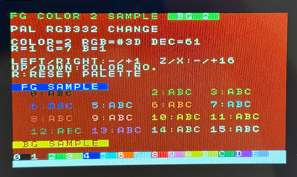

# GivetakeJam BASIC


Extended IchigoJam BASIC for Raspberry Pi Pico with a 4096-byte program area, expanded arrays, improved external EEPROM support, NEC infrared reception, environmental sensing, and color display / palette / attribute commands.
## Highlights
- Full compatibility with IchigoJam BASIC 1.6.1 commands
- Program size expanded from 1024 bytes to 4096 bytes
- Internal flash storage slots
  - Raspberry Pi Pico / RP2040: 25 slots
  - Raspberry Pi Pico 2 / RP2350: 100 slots
- Array variables expanded from `[0]..[101]` to RP2040:`[0]..[357]`, RP2350:`[0]..[1125]`
- Added `VAR2` area at `#C00`
- LIST area moved to RP2040:`#E00`, RP2350:`#1400`
- Improved external EEPROM handling
- Added `IR.IN` command for NEC infrared reception
- Added `ENV.IN` command for AHT20 + BMP280 environment sensing
- Fixed `WS.LED` array access for extended arrays and added bounds checking
- `VER()` returns `16126` on Raspberry Pi Pico 2 / RP2350
- Added `COLOR f[,b[,c]]` command for HSTX DVI text colors
- Added `PAL n,v`, `PAL RESET`, and `PAL(n)` for RGB332 palette control
- Added `ATTR x,y,a` and `ATTR(x,y)` for text color attribute control
- Added MSX-style `COLOR f[,b[,c]]` command for RP2350 HSTX DVI text output
## Memory Map
```text
#000 CHAR
#700 PCG
#800 VAR
#900 VRAM
#C00 VAR2
#E00 LIST (RP2040)
#1400 LIST (RP2350)
```
## Features / Changes
- Expanded program size from 1024 bytes to 4096 bytes per program
- Reduced internal storage slots from 100 to 25
- Extended array variables
  - Original: `[0]..[101]`
  - Extended: RP2040: `[102]..[357]`, RP2350: `[102]..[1125]`
  - `VAR`  = `#800..#8CA`
  - `VAR2` = RP2040: `#C00..#DFE`, RP2350: `#C00..#13FE`
- Fixed array-related issues
  - Correct handling of extended array area
  - Fixed `FOR/NEXT` behavior with array variables
  - `CLV` / `CLEAR` now reset the extended array region
  - Added support for indirect array access `[[x]]`
  - Fixed `WS.LED` array access to use the extended BASIC array area correctly
  -  On the RP2350 build, up to 375 WS2812B LEDs can be driven from array elements `[0]..[1124]`
  - `WS.LED` now reports `Index out of range` when the requested LED count exceeds the available BASIC array range.
- Improved `FILES` command behavior
  - `FILES` → internal storage only RP2040(`0..24`), RP2350(`0..99`)
  - `FILES0` → internal + external EEPROM (`100..131` if detected)
  - `FILES n` → shows `0..n` and skips unused `25..99`
- Improved external EEPROM support
  - Detection by I2C address `0x50`
  - Works with `24LC64`, `24LC256`, and `24FC1025`
  - Safe 32-byte write chunks for multi-device support
- Added `IR.IN` command for HX1838-compatible NEC infrared receiver modules
- Added `ENV.IN` command for AHT20 + BMP280 environment sensing
- Built-in `HELP` memory map updated
- `VER()` returns `16115` on Raspberry Pi Pico / RP2040
- `VER()` returns `16126` on Raspberry Pi Pico 2 / RP2350
- Platform identification by `VER(1)`
  - Raspberry Pi Pico / RP2040: `8`
  - Raspberry Pi Pico 2 / RP2350: `9`
## IR.IN Command
`IR.IN` receives NEC-format infrared codes from an HX1838-compatible receiver.
### Syntax
```basic
IR.IN port,[n]
```
### Result Layout
- `[n+0]` = raw byte 0
- `[n+1]` = raw byte 1
- `[n+2]` = raw byte 2
- `[n+3]` = raw byte 3
- `[n+4]` = repeat flag
- `[n+5]` = error code
- `[n+6]` = mode
  - `0` = standard NEC
  - `1` = NEC extended
### Example
```basic
10 ' IR.IN Test Program
20 IR.IN 1,[0]
30 LED 0: ' not busy
40 IF [5]<>0 GOTO 20
50 IF [4]<>0 GOTO 20
60 LED 1: ' busy
70 ? HEX$([0],2);HEX$([1],2);HEX$([2],2);HEX$([3],2)
80 WAIT 5
90 GOTO 20
```
### Example Output
```text
807F01FE
```
### Notes
- HX1838 output is assumed to be idle HIGH
- The 38kHz carrier is already demodulated by the receiver module
- For stable operation, error filtering and repeat filtering are recommended
- The timing-critical decode section is protected after leader detection
## Raspberry Pi Pico 2 / RP2350 Support
The Raspberry Pi Pico 2 / RP2350 build supports HSTX DVI video output.
Confirmed features on Pico 2:
- HSTX DVI video output
  - Optimized HSTX DVI text rendering by updating only dirty screen rows.
  - Fixed DRAW screen update with dirty-row rendering.
- USB keyboard input
  - Default keyboard layout is Japanese when the keyboard setting flash area is unset.
- `BEEP` / `PLAY` sound output on GPIO20
- `VIDEO 0` / `VIDEO 1` display control
  - `VIDEO 0` clears the screen and stops screen updates
  - the HSTX DVI signal itself continues running
  - `VIDEO 1` resumes screen updates and fixed screen redraw after resume.
- `IR.IN` using RP2350 PIO + DMA
  - confirmed on IN1 to IN4
  - result array: `[0]` to `[6]`
  - IR DMA uses channel 10
- Internal flash `SAVE` / `LOAD` / `FILES`
  - Internal flash slots `0` to `99`
- External I2C EEPROM slots `100` to `131`
- `LRUN` from external EEPROM
### Pico 2 IR.IN Example
```basic
10 CLS
20 IR.IN 4,[0]:IF [5]<>0 CONT
30 A=[2] & #FF
40 ?HEX$(A,2)
```
For the Pico 2 HSTX DVI build, HSTX video uses DMA channels 0 and 1.
The RP2350 `IR.IN` PIO DMA implementation uses DMA channel 10, so it does not conflict with HSTX video DMA.
## COLOR Command
`COLOR` sets text colors for the RP2350 / Pico 2 HSTX DVI build.
On the Raspberry Pi Pico / RP2040 build, `COLOR` is not supported and results in a syntax error.
### Syntax
```basic
COLOR f
COLOR f,b
COLOR f,b,c
```
- `f`: foreground color, 0-15
- `b`: background color, 0-15
- `c`: border/surrounding color, 0-15
The current implementation affects newly printed text and `CLS`; existing text is not recolored retroactively.
### Example
```basic
CLS
COLOR 15,1,1
?"WHITE"
COLOR 10,1,1
?"YELLOW"
COLOR 8,1,1
?"RED"
```
## PAL Command
`PAL` controls the RGB332 palette for the RP2350 / Pico 2 HSTX DVI build.
On the Raspberry Pi Pico / RP2040 build, `PAL` is not supported and results in a syntax error.
### Syntax
```basic
PAL n,v
V=PAL(n)
PAL RESET
```
- `n`: color number, 0-15
- `v`: RGB332 palette value, 0-255
- `PAL n,v`: sets the RGB332 palette value for color number `n`
- `PAL(n)`: returns the current RGB332 palette value for color number `n`
- `PAL RESET`: restores the default firmware palette
### RGB332 Format
```text
bit7..5 : Red   0..7
bit4..2 : Green 0..7
bit1..0 : Blue  0..3
```
### Example
```basic
10 CLS
20 ?PAL(10)
30 PAL 10,#E0
40 ?PAL(10)
50 PAL RESET
60 ?PAL(10)
70 COLOR 10,1,1
80 ?"PAL RESET OK"
```
## ATTR Command
`ATTR` changes or reads the color attribute of an already displayed text cell on the RP2350 / Pico 2 HSTX DVI build.
On the Raspberry Pi Pico / RP2040 build, `ATTR` is not supported and results in a syntax error.
### Syntax
```basic
ATTR x,y,a
A=ATTR(x,y)
```
- `x,y`: screen position
- `a`: text color attribute value, 0-255
- lower 4 bits: foreground color
- upper 4 bits: background color
### Attribute Format
```basic
A=FG+BG*16
FG=A&#F
BG=A>>4
```
### Example
```basic
10 CLS
20 COLOR 15,1,1
30 LC 5,5:?"A"
40 ?ATTR(5,5)
50 ATTR 5,5,15+8*16
60 ?ATTR(5,5)
```
This example changes the displayed `A` to white text on a red background.
## ENV.IN Command
`ENV.IN` reads temperature and humidity from AHT20 and pressure from BMP280 over I2C.
### Syntax
```basic
ENV.IN [n]
```
### Result Layout
- `[n+0]` = temperature from AHT20 in 0.1°C units
- `[n+1]` = humidity from AHT20 in 0.1%RH units
- `[n+2]` = pressure from BMP280 in 0.1 hPa units
- `[n+3]` = temperature from BMP280 in 0.1°C units
- `[n+4]` = error code
- `[n+5]` = status flag
  - bit0 = AHT20 OK
  - bit1 = BMP280 OK
### Error Codes
- `0` = success
- `1` = AHT20 not found
- `2` = BMP280 not found (not fatal if AHT20 is available)
- `3` = AHT20 measurement failed
- `4` = BMP280 read failed
- `5` = BMP280 chip ID mismatch
### Example
```basic
10 ' ENV.IN Test Program
20 ENV.IN [0]
30 IF [4]<>0 THEN ? "ERR=";[4]:GOTO 20
40 T=[0]
50 ? "T=";
60 IF T<0 ? "-";:T=-T
70 ? T/10;".";T%10;"C"
80 ? "H=";[1]/10;".";[1]%10;"%"
90 IF [5]=3 THEN ? "P=";[2]/10;".";[2]%10;"hPa"
100 IF [5]=1 THEN ? "P=N/A"
110 WAIT 60
120 GOTO 20
```
## Build Environment
Create the build environment inside the `IchigoJam_P` directory.
### Required tools
- CMake
- GCC
### Required libraries
Place the following under the `IchigoJam_P` directory:
- `IchigoJam_BASIC`
  - Copy the `IchigoJam_BASIC` directory from one level above
- `pico-sdk`
  - Repository: `https://github.com/NaturalStyle/pico-sdk.git`
  - Use commit `196662b`
  - Update submodules:
    ```sh
    git submodule update --init --recursive
    ```
- `pico-extras`
  - Repository: `https://github.com/raspberrypi/pico-extras.git`
  - Development used commit `09c64d5`
- `PicoDVI`
  - Repository: `https://github.com/mlorenzati/PicoDVI.git`
  - Use commit `579eecc`
### Environment variables
```sh
PICO_SDK_PATH=foo/IchigoJam_P/pico-sdk
PICO_EXTRAS_PATH=foo/IchigoJam_P/pico-extras
```
See the Raspberry Pi documentation for details.
## Build
```sh
cd IchigoJam_P
mkdir build
cd build
cmake ..
make
```
When `IchigoJam_P.uf2` is generated, write it to the Raspberry Pi Pico.
## If Something Goes Wrong
Try deleting the `build` directory and rebuilding from scratch.
This is especially effective when video output becomes unstable.
## Files to Overwrite for the 4K Version
Copy the following files from the `GivetakeJam_P` directory into the corresponding `IchigoJam_P` directories:
- `IchigoJam_BASIC`
  - `basic.h`
  - `ram.h`
  - `tokens_v1.5.h`
- `src`
  - `config.h`
  - `i2ceeprom.h`
  - `storage.h`
  - `io.h`
Then build as usual. When `IchigoJam_P.uf2` is generated, write it to the Pico.
## Raspberry Pi Pico / RP2040 Firmware / Checksum
### Write this firmware to Raspberry Pi Pico / RP2040.
- `IchigoJam_P.uf2`
  - `SHA-256`: `6F290119F925896602041F9F3A6D4E5E966A5D7A855424FEBC09CBB938215E5E`
  - `MD5`: `EBE5EF75F4A9350468FCD01FE41C4498`
  - `SHA-1`: `2DDD653B6BE92F7A082F66D29C4EC83D9F008C04`
## Raspberry Pi Pico 2 / RP2350 Firmware / Checksum
### Write this firmware to Raspberry Pi Pico 2 / RP2350.
- `GivetakeJam_P.uf2`
  - `SHA-256`: `30B67995066E759BCE4B1C797B4529E0784F3CD52BBAAD4002C8A6DBB9ECC1FD`
  - `MD5`: `3D0502D424BCA85C52FD7517562A567B`
  - `SHA-1`: `66C7E88882003CA7BD01E49931C90A65FB085980`
## Test Programs
- `ARRAY_VAR_TOTAL_TEST.BAS`
  - Comprehensive array-variable test
  - Verified to finish with `ALL OK`
- `IR_IN_TEST.BAS`
  - NEC infrared receiver test
- `ENV_IN_TEST.BAS`
  - AHT20 + BMP280 environment sensor test
- `ICHIGO_EATER_COLOR.BAS`
  - COLOR command used game
- `PAL_RGB332_CHANGE.BAS`
  - PAL / RGB332 palette change sample for RP2350 HSTX DVI
  - Use cursor keys to select a color number and adjust its RGB332 palette value.
  - `R` restores the default firmware palette with `PAL RESET`.
## Screenshots
### Runtime Environment

### Display Examples

### IchigoJam_P Compatible Board ( GivetakeJam-P )

### COLOR Command used game ( ICHIGO EATER COLOR )


### PAL RGB332 change sample


`PAL_RGB332_CHANGE.BAS` is a sample program for checking and adjusting the RP2350 HSTX DVI RGB332 palette.

The program displays the selected color number, its RGB332 value, the decoded R/G/B components, foreground samples, and background samples.
Use the cursor keys to select a color number and change the palette value.
Press `R` to restore the default firmware palette with `PAL RESET`.
## Known Limitations / Notes
- Program size is limited to 4096 bytes
- Internal storage provides 25 slots
- External EEPROM display range is fixed to `100..131`
  - `24LC64` → 2 slots
  - `24LC256` → 8 slots
  - `24FC1025` → 32 slots
- Actual usable slots depend on EEPROM capacity
- EEPROM detection uses I2C address `0x50`
- 16-bit signed integers only (`-32768..32767`)
- No floating point support
- Labels ending with digits may cause syntax errors
- Division is integer-only
- For stable IR reception, repeat filtering is recommended in BASIC
## License
Copyright 2014-2025 the IchigoJam authors. All rights reserved.
MIT license.
https://ichigojam.net/license
## Trademark
- IchigoJam is a registered trademark of jig.jp Co., Ltd.
- Raspberry Pi is a registered trademark of the Raspberry Pi Foundation.
## Terms of Use
Please download after agreeing to the terms of use.
A license is required for redistribution to third parties.
- Terms of use: https://pcn.club/sp/ijp/
- IchigoJam Royalty-Free Program License: https://ichigojam.net/ichigojam-license.pdf
---
Givetakewinwin
## Change Log
- Created: 2026-05-29
- Updated on 2026-07-18 for Raspberry Pi Pico 2 / RP2350 HSTX DVI support.
- Updated on 2026-07-29 for Raspberry Pi Pico 2 / Array variables 1125.
- Updated on 2026-08-10: Fixed `WS.LED` array access and added bounds checking.
- Updated on 2026-08-14 for Raspberry Pi Pico 2 / Added MSX-style `COLOR` command.
- Updated on 2026-08-22 for Raspberry Pi Pico 2 / Added palette control and text attribute commands.
- Updated on 2026-08-23 for Raspberry Pi Pico 2 / Refresh HSTX DVI display after `POKE` writes to VRAM and PCG.
